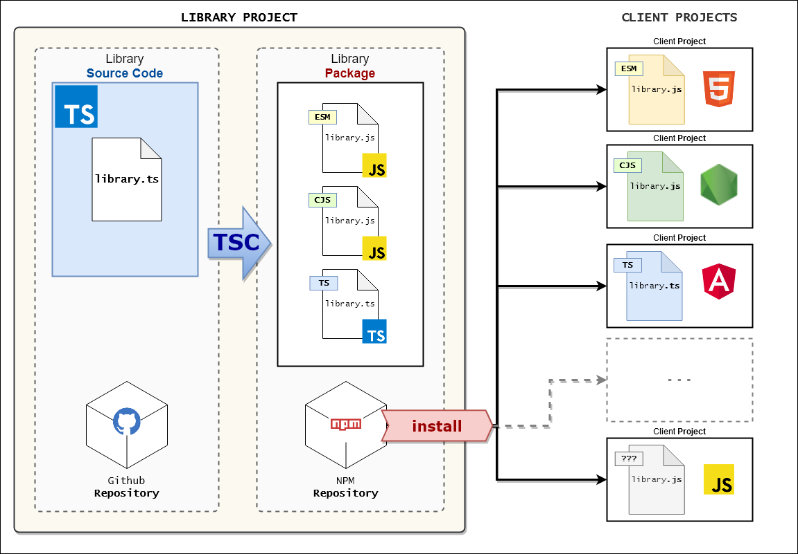

# One Typescript for all

This is a PoC demonstrating a Typescript project with multiple targets (CJS, ESM, CLI...).

## Objective

### **SINGLE TYPESCRIPT INPUT &rightarrow; MULTIPLE OUTPUT**

- <u>**Implement**</u> a library using **Typescript exclusively**.
- <u>**Use**</u> the library with any client which is able to use/run **CommonJS, ECMAScript or Typescript modules**.

### **RUN ESM LIBRARIES IN THE BROWSER**

A *browser app/client* may use the *ESM library* directly. In this case, a **modern browser** is required.
This use case is demonstrated in this PoC.

Older browser would require to adapt the scripts before integration, using a supplemental "transpiler" to output compatible scripts - hence requiring a further implementation step. Such browsers aren't in the focus of this project. 

## Requirements

**Node.js** and **NPM** (or **yarn**) should be "globally" installed on your system to ease the installation of the packages and/or source files.
Preferably:
- node: >=13.x
- npm: >=6.x

**Typescript** may be globally present as well, thus is not required, since the PoC will use its own (local) version:
- tsc: >=3.9.5 (earlier version like 3.8.x should be ok)

## Utilization versus Development

The PoC is configured (`package.json` and `.gitignore`) to separate development and usage of the lib/app.

1. The bare **sources** (typescript only)  of the library and application are stored in the **Github Repository**.
  use this if you'd like to **develop**, adapt etc. the library/application

1. The **transpiled** i.e. usable library (ESM, CommonJS, Typescript and `*.d.ts` types files ) is stored in the **NPM repository** - though without the source files.  
  use this if you'd like to **use** the library/application in your project.

This separation is intended to <u>reduce the size</u> of the given packages to the min possible and to <u>clearly separate the different concerns</u>.
